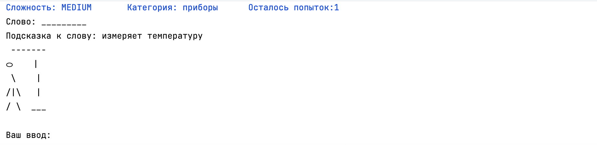

# Академия Бэкенда 2024. ДЗ-1. Игра "Виселица"
> Made by Ilya Tyamin, tg [@mrshrimp_it](https://t.me/mrshrimp_it)
## Настройка игры
Для быстрой конфигурации игры до запуска проекта в папке [resources](/src/main/resources) были созданы два JSON-файла

### Настройка банка вопросов
1. [questions.json](/src/main/resources/questions.json) -- в нем находится список из слов, которые могут быть загаданы во время игры в виселицу.
Каждое из слов представляет себя JSON, в котором есть как обязательные поля, так и опциональное.

Каждое из слов характеризуется тремя обязательными полями:
1. `name` - само загадываемое слово
2. `category` - категория данного слова
3. `difficult` - одно из трех EASY, MEDIUM, HARD. 
А также необязательное поле - `hint`. К слову можно дать подсказку (а можно и не давать, это не приведет к неожиданным последствиям). Подробнее о подсказках будет сказано ниже. 

Количество слов неограничено, на момент последнего коммита, файл содержит какое-то количество вопросов, необходимых для тестирования случайности выбора сложности, категории и вопросов внутри одной конфигурации.

Можно добавлять также и свои слова, свои категории. Стоит также упомянуть, что при десериализации все слова приводятся к нижнему регистру (в том числе и категории), поэтому **регистр данных не важен**.

### Настройка игровой сессии
2. [config.json](/src/main/resources/config.json) -- JSON, содержащий пока лишь одно поле `numberOfAttempts` - количество попыток, которые даются пользователю. При расширении игры, возможно указание в этом файле и других констант

Стоит отдельно упомянуть, что количество попыток подвергается валидации. Разрешенный диапазон значений: $\in [1, 9]$. В случае указания неверного количества попыток (например, -10, 1000), значение будет установлено в стандартное значение, равное пяти.

## Подсказки
Дополнительно, была реализована механика  использования подсказок к слову.

В первую очередь, чтобы пользователь смог получить подсказку, нужно указать ее как параметр `hint` в JSON-представлении слова в конфигурационном файле `questions.json`.

Подсказка активируется и показывается пользователю, **как только у него остается меньше чем $N/2$ попыток**, где $N$ - количество разрешенных попыток (указывается в другом конфигурационном файле).

Пример использования подсказки:

## Обработка неверного ввода
При неверном вводе пользователя программа запрашивает данные заново, пока не получит правильные данные. Ошибки выводятся в поток вывода и окрашены в красный цвет.

Регистр не влияет на ввод пользователя, важна сама суть ввода

Такое может происходить при:
- Неверном вводе категории
- Неверном вводе сложности
- Вводе больше чем одной буквы во время основной игры
- В других более мелких случаях

## Мелочи
1. После каждого ввода буквы, происходит `flush` консоли, но в стандартных IDE его не видно, но он есть
2. В консоли используется цветной ввод / вывод для лучшего отображения важной информации. Например, ошибки о вводе / выводе отображаются красным
3. Я не художник, поэтому извиняюсь за мои способности рисования
4. При наличии нескольких слов, подходящих под конфигурацию "сложность - категория", выбирается случайное из них

## Спасибо, что дочитали!

