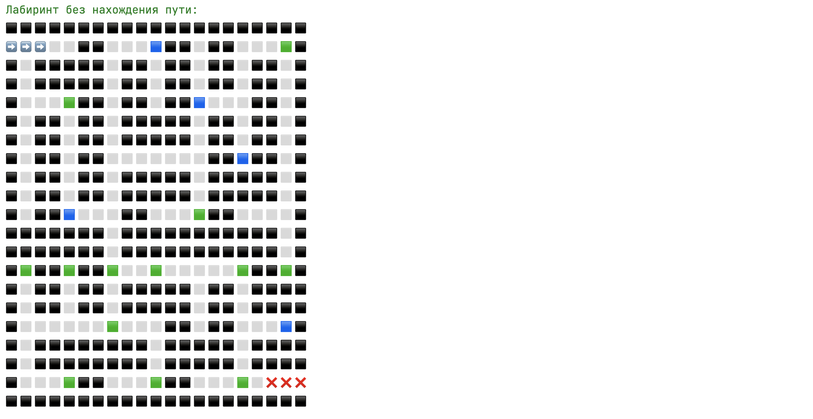
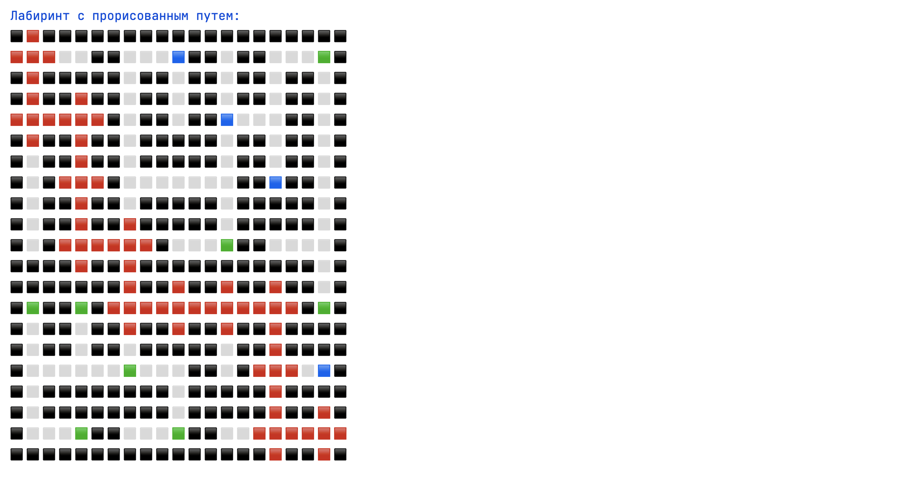
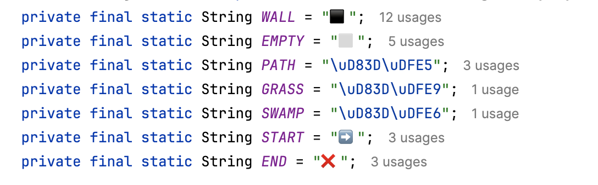
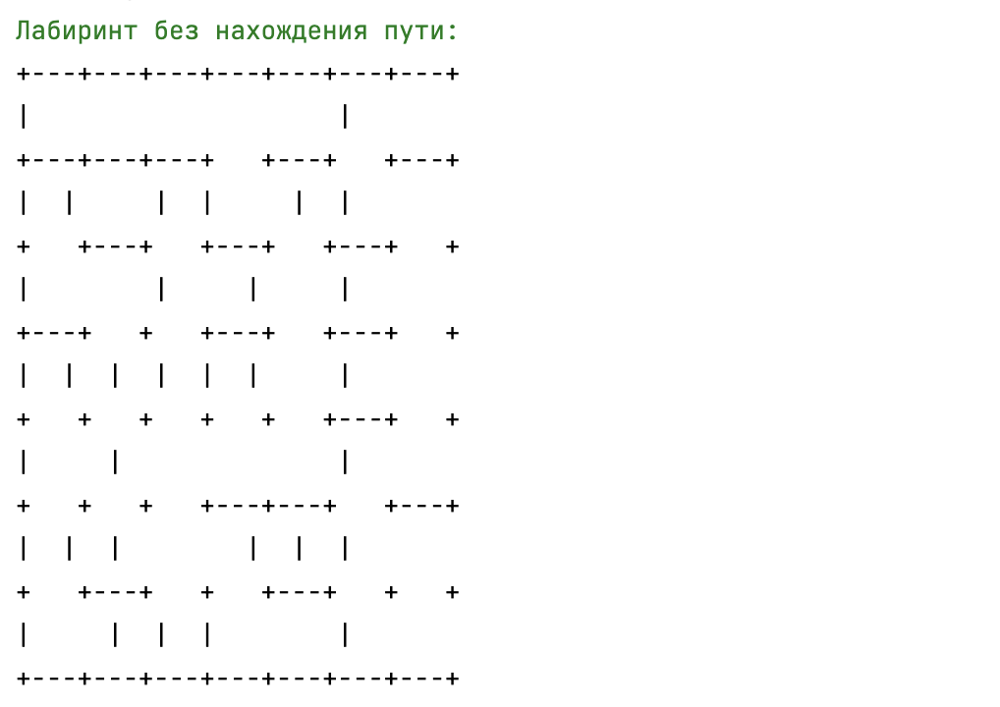
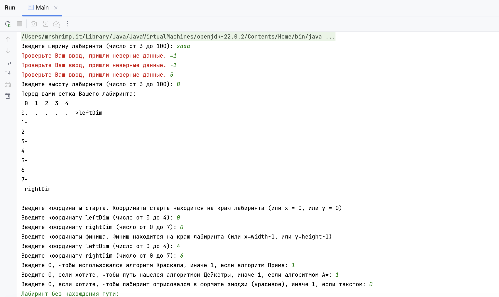
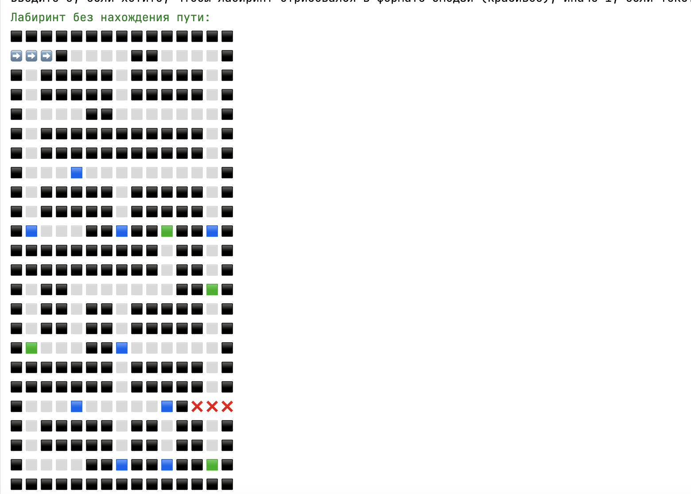
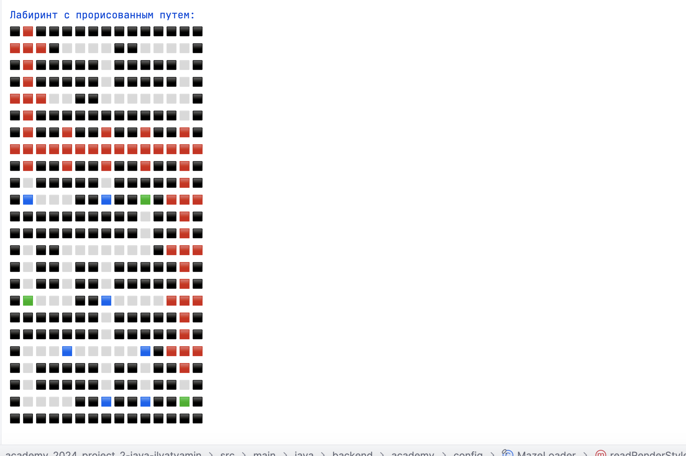

## ДЗ-2. Академия Бэкенда 23/24

### Илья Тямин, tg [@mrshrimp_it](https://t.me/mrshrimp_it)

## Используемые алгоритмы

### Генерация лабиринта

Я использую два алгоритма построения минимального остовного дерева: **алгоритм Прима и Краскала**. Также я оставлял кратко комментарии в коде по тому, как они работают.

Оба алгоритма реализуют интерфейс `MazeGenerator` и все распологаются в этой [директории](src/main/java/backend/academy/generators/).

Для алгоритма Краскала я также использую структуру данных UnionFind, ее реализацию я также привел в коде (ранее реализовывал на курсе по АиСД в универе). Использовал UnionFind из-за того, что это не сложно, но понижает общую асимптотику решения.

Для алгоритма Прима также можно улучшить асимптотику засчет Фибоначиевой кучи, но это прям хардкор 0_0.

### Улучшающие / ухудшающие поверхности

При генерации алгоритма также генерируются улудшающие / ухудшающие поверхности. Ухудшающая поверхность у меня представлена как болото, а улудшающая поверхность как трава. Они генерируются случайно при определении типа ячейки (15% вероятности, что выпадет трава, 15%, что болото и 70%, что обычная ячейка).

Определение типа ячейки можно посмотреть [вот здесь](src/main/java/backend/academy/maze/CeilType.java).

Это повлияет на следующий пункт, так как в моем представлении на графе болото весит 30 очков, стандартная ячейка 20 очков, а трава -- 10 очков, сделал так, чтобы если что можно было расширить ассортимент поверхностей.

Как отображаются поверхности, можно увидеть ниже (через пару параграфов).

### Поиск пути

Для поиска пути я использую алгоритмы Дейкстры и A\*. Выбор был именно таким, так как отрицательных ребер нет, а вот ребра разных весов есть, засчет чего некоторые алгоритмы, хоть и простые в реализации, по типу алгоритма Беллмана-Форда отпадают :(

> При реализации алгоритма A\* я в качестве эвристики использовал Манхеттенское расстояние, так как у нас лабиринт представим в виде сетки и Манхеттенское здесь подходит лучше чем, например, евклидово.

Оба алгоритма реализуют интерфейс `MazeSolver` и все распологаются в этой [директории](src/main/java/backend/academy/solvers/). В коде есть небольшие комментарии, но, в целом, алгоритмы классические.

После вычисления кратчайшего пути, я нахожу путь backtrace-ом (иду с конца к началу, при подсчете путей я записывал "родителей" ячеек).

### Рендер в консоли + примеры

Тут я тоже привел два способа. Один из способов -- просто генерация с помощью символов "-", "|", "+" и других (это [TextRenderer](src/main/java/backend/academy/renderers/TextRenderer.java)). Кроме того, есть красивый вывод с помощью emojji (его я и всегда использовал), однако в консоли он будет иметь немного больший размер, засчет того, что к каждой ячейке я должен дополнительно сгенерировать еще верхнюю, левую, правую и нижнюю стенки.

Оба алгоритма реализуют интерфейс `MazeRenderer` и все распологаются в этой [директории](src/main/java/backend/academy/renderers/).

После ввода всех параметров в консоль всегда отрисовываются два вида лабиринтов: простой и с нарисованным путем.

Приведу пример генерации с помощью emoji:

Как Вы могли заметить, путь выделяется красным.

> Трава выделяется зеленым, болото -- синим. Обычные ячейки -- белые, стенки -- черные

Все это происходит засчет того, что в EmojiRenderer определен набор констант:

В то время как, рендер текстом выглядит вот так:

## Настройка генерации

По умолчанию, максимальный размер лабиринтов -- 100, а минимальный -- 3. Но эти значения можно поменять в JSON-файле: [тык](src/main/resources/config.json). Данные автоматом загружаются при запуске программы и будут учтены при всех генерациях.

За считывание JSON-а отвечает Jackson и класс [GenerationParamsLoader](src/main/java/backend/academy/config/GenerationParamsLoader.java). Там происходит считывание данных.

## Обработка неверного ввода

Отдельное внимание стоит уделить обработке неверного ввода пользователя. Тут ему есть много чего неправильно ввести, поэтому каждое действие тщательно валидируется. За основу я взял классы с предыдущего ДЗ и местами их отредактировал (основная идея: выполнять ввод, пока предикат не отдаст true).

За тщательную валидация и ввод данных с InputStream и вывод в PrintStream отвечает класс [MazeLoader](src/main/java/backend/academy/config/MazeLoader.java). Там есть огромный набор методов для:

-   ввода ширины лабиринта
-   ввода высоты лабиринта
-   ввода координат начала и конца

> Я учитываю, что координата входа в лабиринт должна иметь или x = 0, или y = 0, то есть должна быть на краю лабиринта. Аналогично, и с координатой выхода (иначе не логично, если конец лабиринта будет в его середине, но если надо -- это легко правится).

## Пример работы (полный)

Всякие вводы и валидации данных:

Генерация:

> Трава выделяется зеленым, болото -- синим. Обычные ячейки -- белые, стенки -- черные

